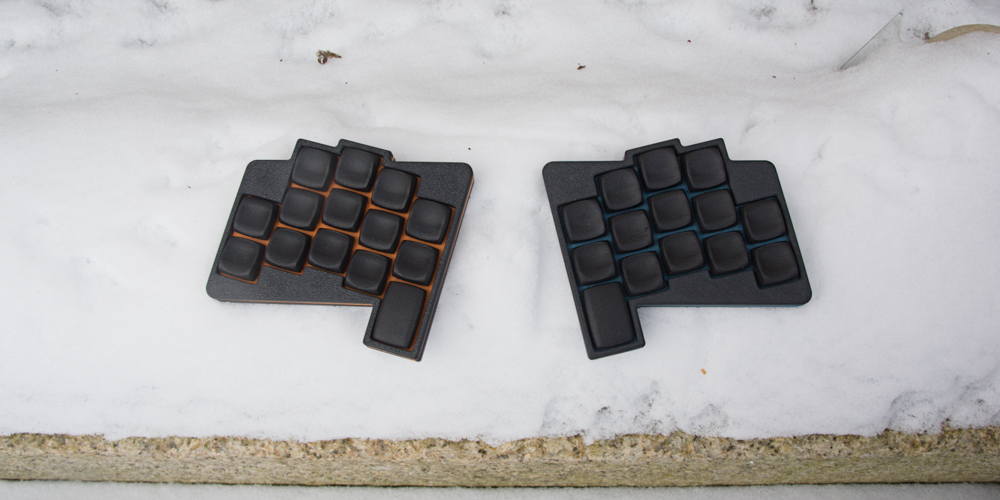
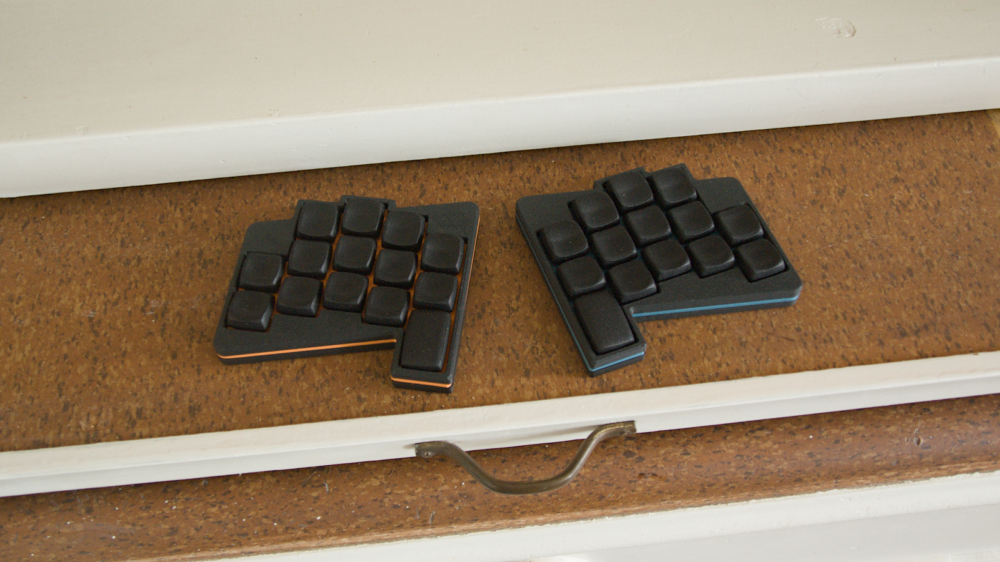

### Grump'it

Grumpish 28 key BLE split keyboard 

## features

- Hotswap sockets (Choc V2)
- Seeed Xiao Controller (w/ ZMK firmware)
- gerber and case files (kicad files, stl as well as freecad files)
- Bluetooth (w/ Xiao BLE)
- completely open source, permissive license ([CERN-OHL-P](https://cern-ohl.web.cern.ch/home))

## want one?

All production files you need to build your own board can be found [here](./prod/).

The PCB is reversable, so you need two for a set.

Apart from pcbs and cases you need:

- 28 hotswap sockets

- 28 diodes (1N4148 int SOT-123)

- 28 of your favourite choc V2 low profile switches

- 2x Seeed Xiao BLE

- 2x LiPo rechargable batteries, 401230 110 mAh fit, you may be able to find others that fit. Max battery dimensions that should fit are 36x13x5mm

- a small piece (2-5 cm) of 1.75mm translucent filament as for the leds.

- 4x M2 heat inserts

- 4x M2 screws, around 8-9 mm should work.

- **optionally** 2x USB Connector C-Type, 12 pin/16pin, mid-mount (1.6mm)

To build just solder all components on one side of the PCB, make sure you don't do the same side twice. Diode direction is marked on the pcb. Solder the battery cable to the same side you mounted the components on and make sure you've got the polarity right.

For the case melt in the heat inserts. Cut off a small piece (so it fits in the groove in the bottom case) and push in into the hole. It should go in with little force.

Then just flash (and optionally change) the firmware and you should be ready to go.

### firmware

Config for ZMK can be found here: 
- [Github actions](https://github.com/weteor/grumpit-zmk-config)
- [local](./firmware).

Bootloader should be available on plugin until firmware is written. After flashing you may access the bootloader by double pressing the reset button.

### special thanks

[Forager](https://github.com/carrefinho/forager) for solving bottom mount Xiaos. I just plainly took his bottom case design for the reset button and led and copied it for this case. Such a great idea!

### the rest

Everything in this repository is free to use however you might see fit. If you want to support me and my projects, please consider linking back to this repository if you build/change/use anything.

If you would like to send me a tip, you could do it [here](https://ko-fi.com/weteor) (Please don't feel like you have to).

### more pictures

